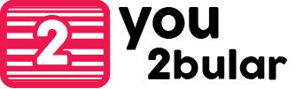

=======================
#### you2bular is a [jQuery Tubular](http://www.seanmccambridge.com/tubular/) fork with better customizations and animations, that aims to be easily integrable with [Bootstrap](http://getbootstrap.com).
## Options

```coffeescript
ratio: 16 / 9 # usually either 4/3 or 16/9
videoId: "tKQxFKV67yk"
mute: true
repeat: true
width: $(window).width()
wrapperZIndex: -1
loopBefore: 1000
start: 10
```

Most of those options should be pretty self explanatory, all but `loopBefore` which determines the numbers of seconds to loop the video before it ends (1 seconds should be enough to prevent the video to stop before it loops).

## EXAMPLE

You should clone the repository and look at the **less** files and the **js** or **Coffeescript** files to understand how it can be integrated into your website, but in a few steps:

- Take the you2bular.less file and `@include` it into your bootstrap project
- Get the you2bular.coffee or js file and source it in your webpage
- Call it in your js/coffeescript file
- Youre ready to go :thumbsup:

<br><hr><br>

# :exclamation: DEVELOPMENT :exclamation:

Bugfixes, forks, suggestions and whatever you've in mind to do with this code, are more than welcome.

<br><hr><br>

### DISTRIBUITED UNDER THE MIT LICENSE (MIT)

Copyright (c) 2014 KrimeFarm

Permission is hereby granted, free of charge, to any person obtaining a copy
of this software and associated documentation files (the "Software"), to deal
in the Software without restriction, including without limitation the rights
to use, copy, modify, merge, publish, distribute, sublicense, and/or sell
copies of the Software, and to permit persons to whom the Software is
furnished to do so, subject to the following conditions:

The above copyright notice and this permission notice shall be included in all
copies or substantial portions of the Software.

THE SOFTWARE IS PROVIDED "AS IS", WITHOUT WARRANTY OF ANY KIND, EXPRESS OR
IMPLIED, INCLUDING BUT NOT LIMITED TO THE WARRANTIES OF MERCHANTABILITY,
FITNESS FOR A PARTICULAR PURPOSE AND NONINFRINGEMENT. IN NO EVENT SHALL THE
AUTHORS OR COPYRIGHT HOLDERS BE LIABLE FOR ANY CLAIM, DAMAGES OR OTHER
LIABILITY, WHETHER IN AN ACTION OF CONTRACT, TORT OR OTHERWISE, ARISING FROM,
OUT OF OR IN CONNECTION WITH THE SOFTWARE OR THE USE OR OTHER DEALINGS IN THE
SOFTWARE.
